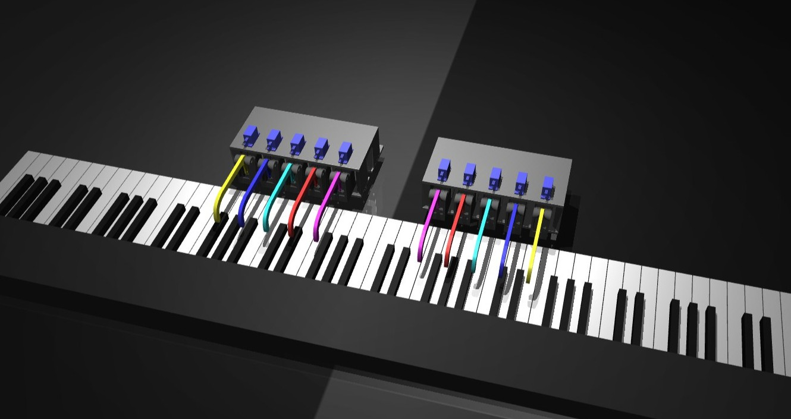

# Bot-hoven - Reinforcement Learning Simulation Environment

This repository contains software for the MuJoCo-based physics simulation where our robotic system learns to play the piano. A picture of this environment is shown below:



### Installation

Clone the repository:

```bash
git clone https://github.com/alessandropotenza/bothoven-sim.git && cd bothoven-sim
```

Install the prerequisite dependencies:

```bash
git submodule init && git submodule update
bash scripts/install_deps.sh
```

Create a new conda environment and install the package in editable mode:

```bash
conda create -n bothoven python=3.10
conda activate bothoven

pip install -e ".[dev]"
```

## Acknowledgements
This project builds upon [RoboPianist](https://github.com/google-research/robopianist) from Google Research. We thank the original authors for their foundational work and have adapted their code to meet the objectives of our capstone project.
